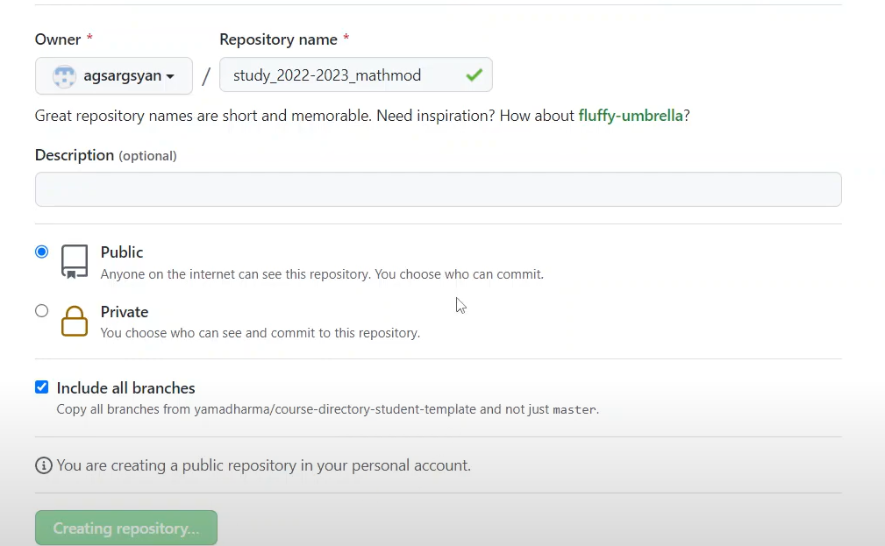
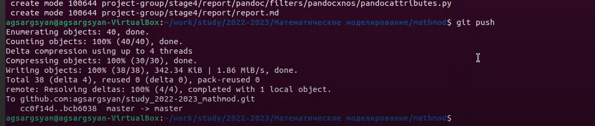
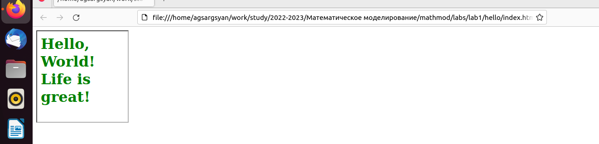

---
## Front matter
lang: ru-RU
title: Структура научной презентации
subtitle: Простейший шаблон
author:
  - Саргсян А. Г.
institute:
  - Российский университет дружбы народов, Москва, Россия
date: 19 мая 2003

## i18n babel
babel-lang: russian
babel-otherlangs: english

## Formatting pdf
toc: false
toc-title: Содержание
slide_level: 2
aspectratio: 169
section-titles: true
theme: metropolis
header-includes:
 - \metroset{progressbar=frametitle,sectionpage=progressbar,numbering=fraction}
 - '\makeatletter'
 - '\beamer@ignorenonframefalse'
 - '\makeatother'
---

# Информация

## Докладчик

:::::::::::::: {.columns align=center}
::: {.column width="70%"}

  * Саргсян Арам Грачьяевич
  * студент кафедры прикладной информатики и теории вероятностей
  * Российский университет дружбы народов

:::
::: {.column width="30%"}

:::
::::::::::::::

# Вводная часть

## Цели и задачи

- Создать отчет лабораторной работы в Markdown
- Проделать команды  и познакомиться с git

# Результаты

## Материалы и методы

- виртуальная машина  ubuntu
- утилиты make, pandoc, ssh

## Результаты

-  (рис. @fig:001).
{#fig:001 width=70%}

-  (рис. @fig:002).
{#fig:002 width=70%}

-  (рис. @fig:003).
{#fig:003 width=70%}

