---
## Front matter
title: "отчёт по лабораторной работе №1"
subtitle: "Простейший вариант"
author: "Арам Грачьяевич Саргсян"

## Generic otions
lang: ru-RU
toc-title: "Содержание"

## Bibliography
bibliography: bib/cite.bib
csl: pandoc/csl/gost-r-7-0-5-2008-numeric.csl

## Pdf output format
toc: true # Table of contents
toc-depth: 2
lof: true # List of figures
lot: true # List of tables
fontsize: 12pt
linestretch: 1.5
papersize: a4
documentclass: scrreprt
## I18n polyglossia
polyglossia-lang:
  name: russian
  options:
	- spelling=modern
	- babelshorthands=true
polyglossia-otherlangs:
  name: english
## I18n babel
babel-lang: russian
babel-otherlangs: english
## Fonts
mainfont: PT Serif
romanfont: PT Serif
sansfont: PT Sans
monofont: PT Mono
mainfontoptions: Ligatures=TeX
romanfontoptions: Ligatures=TeX
sansfontoptions: Ligatures=TeX,Scale=MatchLowercase
monofontoptions: Scale=MatchLowercase,Scale=0.9
## Biblatex
biblatex: true
biblio-style: "gost-numeric"
biblatexoptions:
  - parentracker=true
  - backend=biber
  - hyperref=auto
  - language=auto
  - autolang=other*
  - citestyle=gost-numeric
## Pandoc-crossref LaTeX customization
figureTitle: "Рис."
tableTitle: "Таблица"
listingTitle: "Листинг"
lofTitle: "Список иллюстраций"
lotTitle: "Список таблиц"
lolTitle: "Листинги"
## Misc options
indent: true
header-includes:
  - \usepackage{indentfirst}
  - \usepackage{float} # keep figures where there are in the text
  - \floatplacement{figure}{H} # keep figures where there are in the text
---

# Цель работы

Целью данной работу является создание рабочего пространства и репозитория курса, 
а также ознакомление с средставми git и языком разметки markdown. 

# Задание

Создать рабочее пространство в соответствии с указанными критериями,
выполнить задания из файлов git и markdown.

# Выполнение лабораторной работы

1. Создал репозиторий курса на основе шаблона  (рис. @fig:001).
{#fig:001 width=70%}

2. В своей машине создал рабочий каталог (рис. @fig:002).
{#fig:002 width=70%}

3. Сгенерировал  ssh ключ для подключения к гитхаб (рис. @fig:003).
{#fig:003 width=70%}

4. Добавил ключ в гитхаб (рис. @fig:004).
{#fig:004 width=70%}

5. Клонировал репозиторий в каталог mathmod моей машины. (рис. @fig:005).
{#fig:005 width=70%}

6. Настроил каталог курса (рис. @fig:006).
{#fig:006 width=70%}

7. Сохранил все изменения в репозиторий (рис. @fig:007).
{#fig:007 width=70%}

8. Установил окончания строк и поддержку unicode (рис. @fig:008).
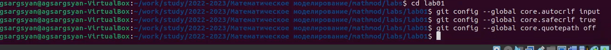{#fig:008 width=70%}

9. Создал страницу «hello world» (рис. @fig:009).
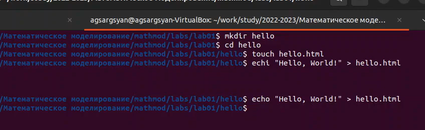{#fig:009 width=70%}

10. Создал локальный репозиторий hello и добавил туда файл hello.html, проверил состояние репозитория (рис. @fig:010).
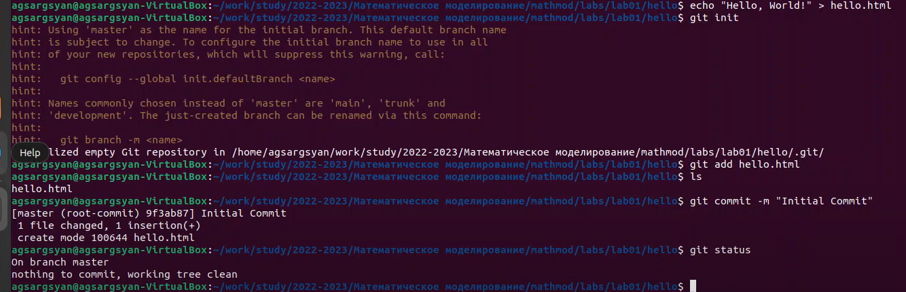{#fig:010 width=70%}

11. Изменил файл hello.html и проверил состояние репозитория, проиндексировал изменения (рис. @fig:011).
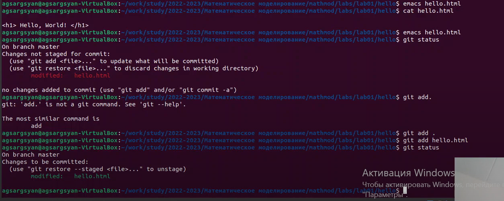{#fig:011 width=70%}

12. Изменил страницу «Hello, World», чтобы она содержала стандартные теги html
и body, проиндексировал изменения (рис. @fig:012).
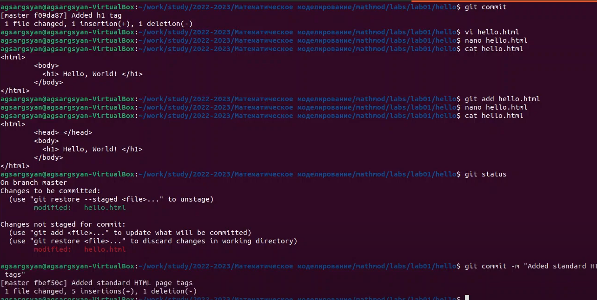{#fig:012 width=70%}

13. Просмотрел историю изменений (рис. @fig:013).
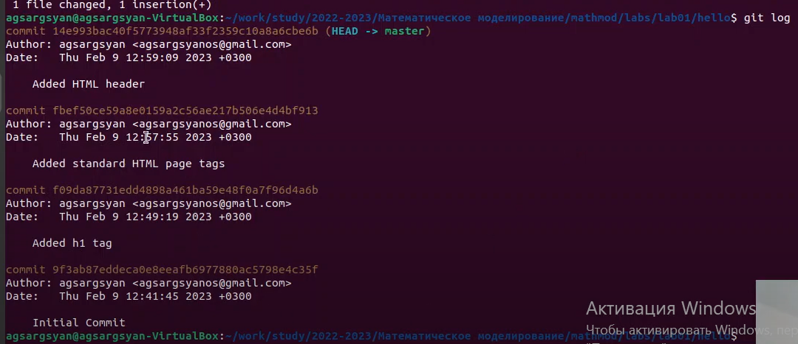{#fig:013 width=70%}

14. Вернулся к предыдущей версии файла (рис. @fig:014).
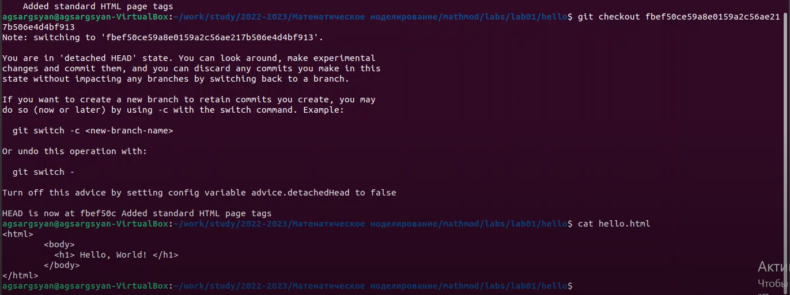{#fig:014 width=70%}
 
15. Вернулся к последней версии, создал тег старой версии и снова откатился туда (рис. @fig:015).
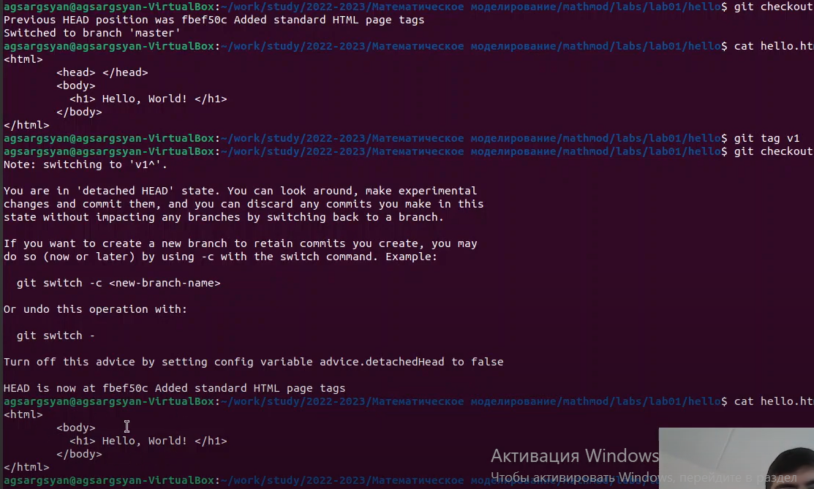{#fig:015 width=70%}

16. Переместил файл hello.html в подкаталог  lib, создал файл index.html, покопался в каталоге .git (рис. @fig:016).
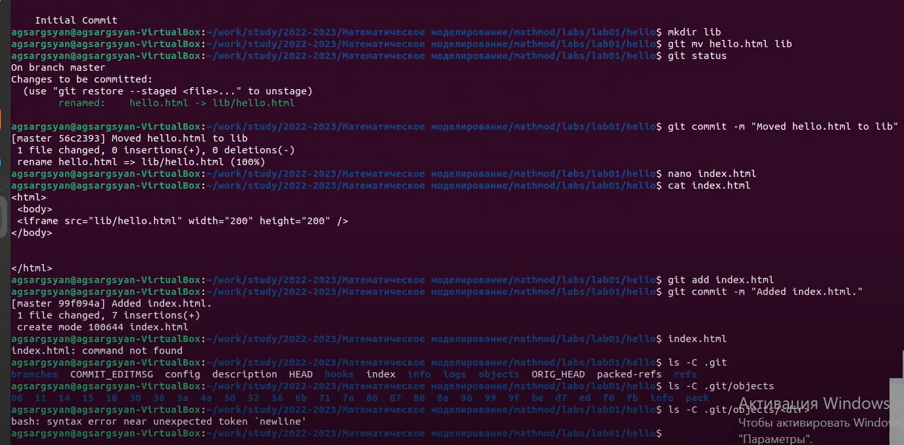{#fig:016 width=70%}
 
17. Вывел коммиты с помощью SHA1 хэша (рис. @fig:017).
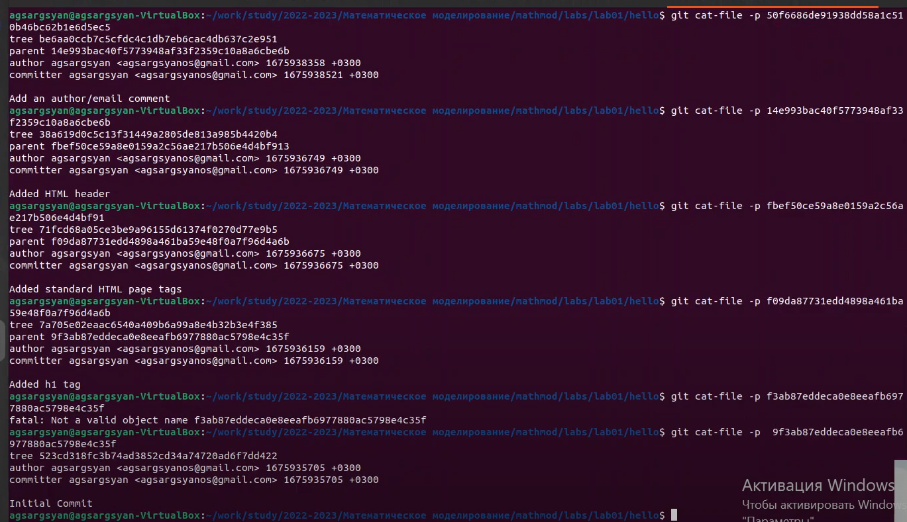{#fig:017 width=70%}

18. Добавил css файл для стиля, изменил index.html и hello.html (рис. @fig:018).
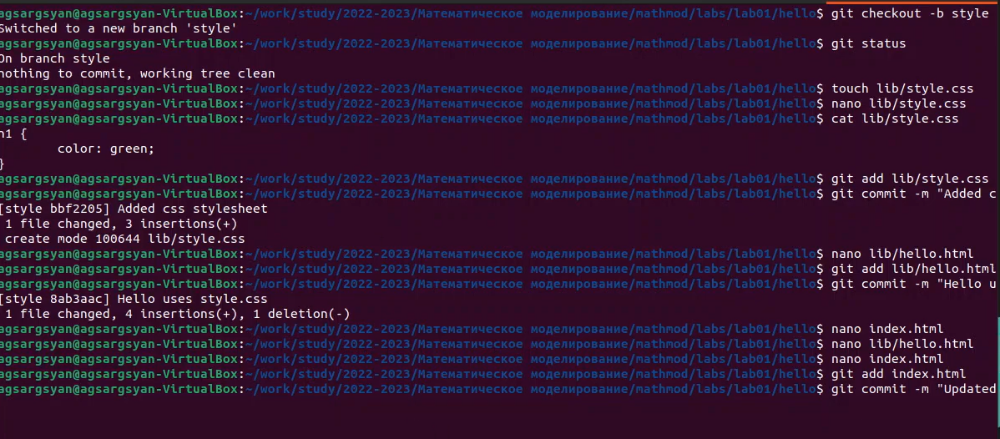{#fig:018 width=70%}

19. Просмотрел, как выглядит окно (рис. @fig:019).
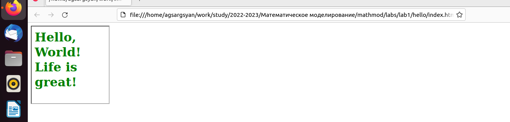{#fig:019 width=70%}

20. Просмотрел дерево коммитов (рис. @fig:020).
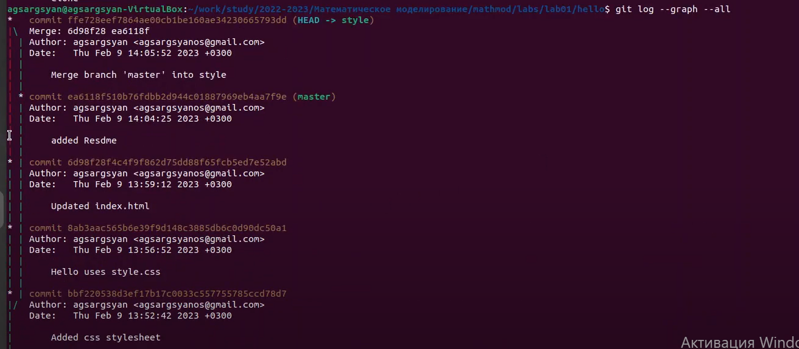{#fig:020 width=70%}

21. Создал конфликт (рис. @fig:021).
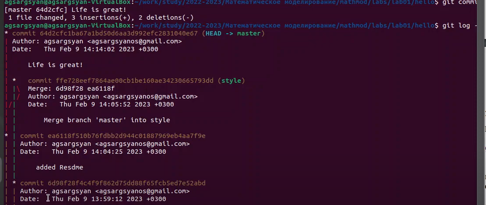{#fig:021 width=70%}

22. Вручную разрешил конфликт (рис. @fig:022).
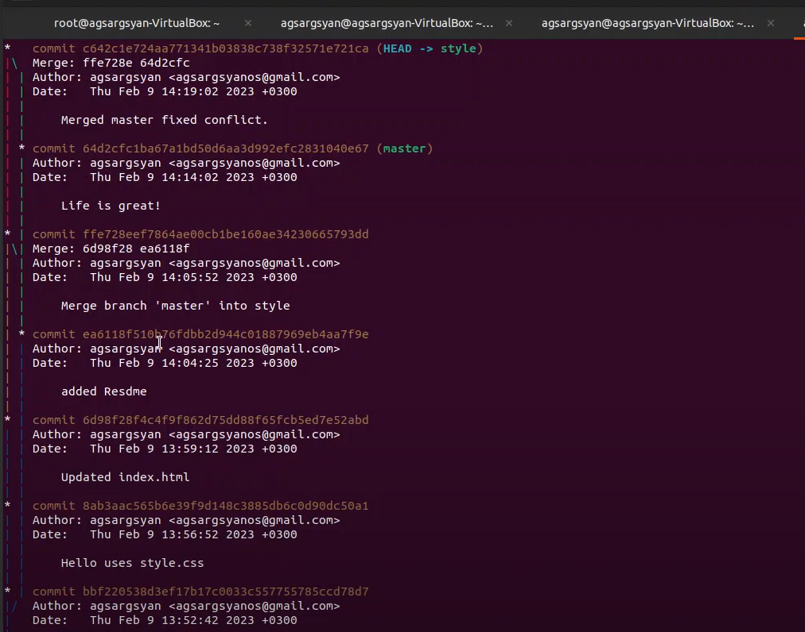{#fig:022 width=70%}

23. Сбросил ветку style (рис. @fig:023).
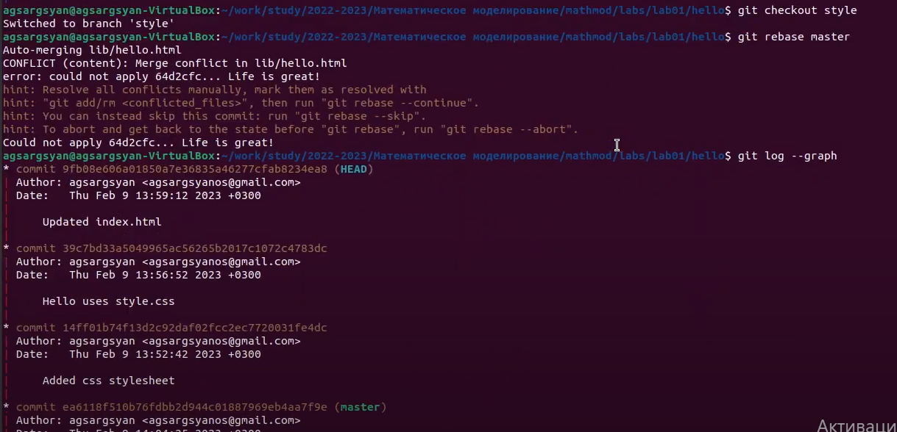{#fig:023 width=70%}

24. Склонировал репозиторий (рис. @fig:024).
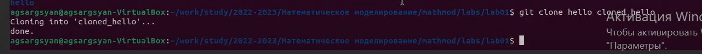{#fig:024 width=70%} 

25. Извлек общие изменения с репозитория (рис. @fig:025).
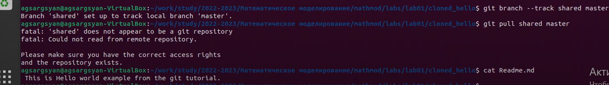{#fig:025 width=70%}
# Выводы

Я установил рабочее пространство и получил навыки для работы с git и  markdown.

