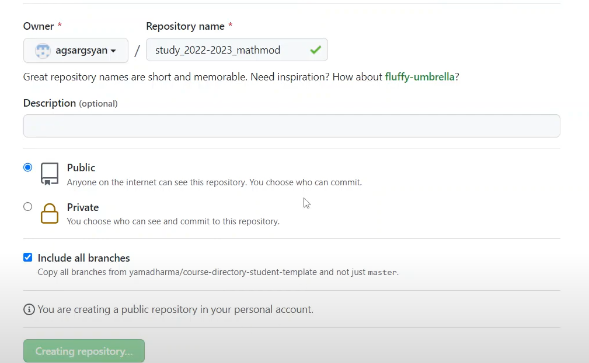
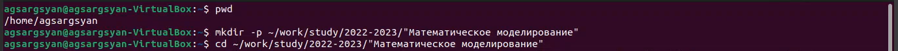
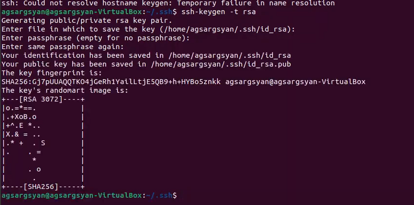
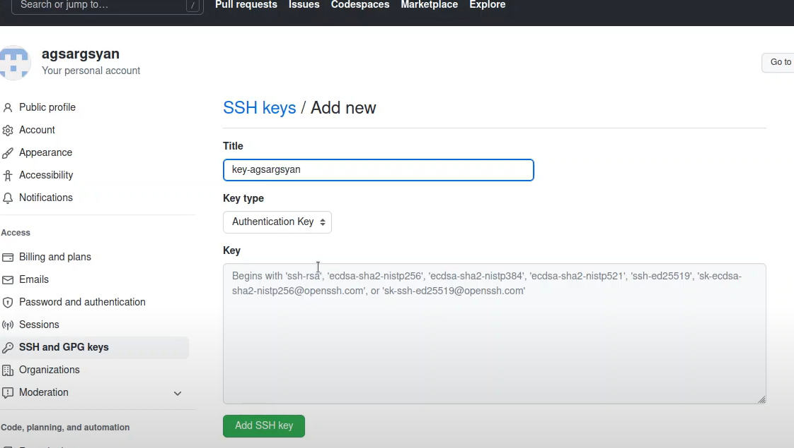
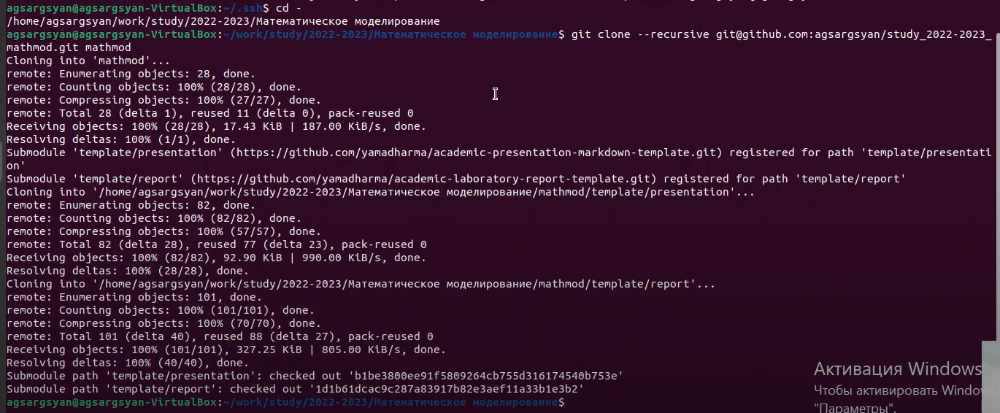
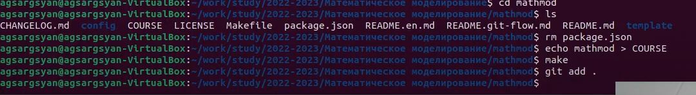
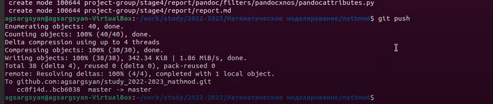

---
## Front matter
title: "отчёт по лабораторной работе №1"
subtitle: "Простейший вариант"
author: "Арам Грачьяевич Саргсян"

## Generic otions
lang: ru-RU
toc-title: "Содержание"

## Bibliography
bibliography: bib/cite.bib
csl: pandoc/csl/gost-r-7-0-5-2008-numeric.csl

## Pdf output format
toc: true # Table of contents
toc-depth: 2
lof: true # List of figures
lot: true # List of tables
fontsize: 12pt
linestretch: 1.5
papersize: a4
documentclass: scrreprt
## I18n polyglossia
polyglossia-lang:
  name: russian
  options:
	- spelling=modern
	- babelshorthands=true
polyglossia-otherlangs:
  name: english
## I18n babel
babel-lang: russian
babel-otherlangs: english
## Fonts
mainfont: PT Serif
romanfont: PT Serif
sansfont: PT Sans
monofont: PT Mono
mainfontoptions: Ligatures=TeX
romanfontoptions: Ligatures=TeX
sansfontoptions: Ligatures=TeX,Scale=MatchLowercase
monofontoptions: Scale=MatchLowercase,Scale=0.9
## Biblatex
biblatex: true
biblio-style: "gost-numeric"
biblatexoptions:
  - parentracker=true
  - backend=biber
  - hyperref=auto
  - language=auto
  - autolang=other*
  - citestyle=gost-numeric
## Pandoc-crossref LaTeX customization
figureTitle: "Рис."
tableTitle: "Таблица"
listingTitle: "Листинг"
lofTitle: "Список иллюстраций"
lotTitle: "Список таблиц"
lolTitle: "Листинги"
## Misc options
indent: true
header-includes:
  - \usepackage{indentfirst}
  - \usepackage{float} # keep figures where there are in the text
  - \floatplacement{figure}{H} # keep figures where there are in the text
---

# Цель работы

Целью данной работу является создание рабочего пространства и репозитория курса, 
а также ознакомление с средставми git и языком разметки markdown. 

# Задание

Создать рабочее пространство в соответствии с указанными критериями,
выполнить задания из файлов git и markdown.

# Выполнение лабораторной работы

1. Создал репозиторий курса на основе шаблона  (рис. @fig:001).

{#fig:001 width=70%}

2. В своей машине создал рабочий каталог (рис. @fig:002).

{#fig:002 width=70%}

3. Сгенерировал  ssh ключ для подключения к гитхаб (рис. @fig:003).

{#fig:003 width=70%}

4. Добавил ключ в гитхаб (рис. @fig:004).

{#fig:004 width=70%}

5. Клонировал репозиторий в каталог mathmod моей машины. (рис. @fig:005).

{#fig:005 width=70%}

6. Настроил каталог курса (рис. @fig:005).

{#fig:005 width=70%}

7. Сохранил все изменения в репозиторий (рис. @fig:005).

{#fig:005 width=70%}

8. Установил окончания строк и поддержку unicode
# Выводы

Я установил рабочее пространство и получил навыки для работы с git и  markdown.

