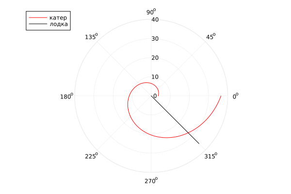

---
## Front matter
title: "Отчёт по лабораторной работе №2"
subtitle: "Задача о Погоне, вариант №11"
author: "Саргсян Арам Грачьяевич"

## Generic otions
lang: ru-RU
toc-title: "Содержание"

## Bibliography
bibliography: bib/cite.bib
csl: pandoc/csl/gost-r-7-0-5-2008-numeric.csl

## Pdf output format
toc: true # Table of contents
toc-depth: 2
lof: true # List of figures
lot: true # List of tables
fontsize: 12pt
linestretch: 1.5
papersize: a4
documentclass: scrreprt
## I18n polyglossia
polyglossia-lang:
  name: russian
  options:
	- spelling=modern
	- babelshorthands=true
polyglossia-otherlangs:
  name: english
## I18n babel
babel-lang: russian
babel-otherlangs: english
## Fonts
mainfont: PT Serif
romanfont: PT Serif
sansfont: PT Sans
monofont: PT Mono
mainfontoptions: Ligatures=TeX
romanfontoptions: Ligatures=TeX
sansfontoptions: Ligatures=TeX,Scale=MatchLowercase
monofontoptions: Scale=MatchLowercase,Scale=0.9
## Biblatex
biblatex: true
biblio-style: "gost-numeric"
biblatexoptions:
  - parentracker=true
  - backend=biber
  - hyperref=auto
  - language=auto
  - autolang=other*
  - citestyle=gost-numeric
## Pandoc-crossref LaTeX customization
figureTitle: "Рис."
tableTitle: "Таблица"
listingTitle: "Листинг"
lofTitle: "Список иллюстраций"
lotTitle: "Список таблиц"
lolTitle: "Листинги"
## Misc options
indent: true
header-includes:
  - \usepackage{indentfirst}
  - \usepackage{float} # keep figures where there are in the text
  - \floatplacement{figure}{H} # keep figures where there are in the text
---

# Цель работы

Приведем один из примеров построения математических моделей для выбора правильной стратегии при решении задач поиска. 
Например, рассмотрим задачу преследования браконьеров береговой охраной. 
На море в тумане катер береговой охраны преследует лодку браконьеров. Через определенный промежуток времени туман рассеивается, 
и лодка обнаруживается на расстоянии k км от катера. Затем лодка снова скрывается в тумане и уходит прямолинейно в неизвестном направлении. 
Известно, что скорость катера в n раза больше скорости браконьерской лодки. 
Необходимо определить по какой траектории необходимо двигаться катеру, чтоб нагнать лодку.

# Задание
На море в тумане катер береговой охраны преследует лодку браконьеров.
Через определенный промежуток времени туман рассеивается, и лодка обнаруживается на расстоянии 6.9 км от катера. 
Затем лодка снова скрывается в тумане и уходит прямолинейно в неизвестном направлении. 
Известно, что скорость катера в 2.9 раза больше скорости браконьерской лодки
1. Запишите уравнение, описывающее движение катера, с начальными условиями для двух случаев.
2. Постройте траекторию движения катера и лодки для двух случаев.
3. Найдите точку пересечения траектории катера и лодки.

# Выполнение лабораторной работы

## Решение 
Принимаем за $t_0=0, X_0=0$  - место нахождения лодки браконьеров в момент обнаружения, $X_0=k$   - место нахождения катера береговой охраны относительно лодки браконьеров в момент обнаружения лодки.

Введем полярные координаты. Считаем, что полюс - это точка обнаружения лодки браконьеров $x_0=0 (\theta=x_0=0)$, а полярная ось r проходит через точку нахождения катера береговой охраны. 

Чтобы найти расстояние $x$ (расстояние после которого катер начнет двигаться вокруг полюса), необходимо составить простое уравнение. Пусть через время $t$ катер и лодка окажутся на одном расстоянии $x$ от полюса. За это время лодка пройдет $x$, а катер $x-k$ (или $x+k$, в зависимости от начального положения катера относительно полюса). Время, за которое они пройдут это расстояние, вычисляется как $\frac{x}{υ}$ или $\frac{x+k}{nυ}$ (для второго случая $\frac{x-k}{nυ}$), где $n=2.9$.  Так как время одно и то же, то эти величины одинаковы. Тогда неизвестное расстояние можно найти из следующего уравнения:  $\frac{x}{υ} = \frac{x+k}{nυ}$ - в первом случае, $\frac{x}{υ} =  \frac{x-k}{nυ}$ во втором случае.

Отсюда мы найдем два значения $x_1$ и $x_2$, задачу будем решать для двух случаев. 

$x_1=\frac{k}{n+1}$ ,при $\theta=0$ или $x_2=\frac{k}{n-1}$ ,при $\theta=-\pi$

После того, как катер береговой охраны окажется на одном расстоянии от полюса, что и лодка, он должен сменить прямолинейную траекторию и начать двигаться вокруг полюса удаляясь от него со скоростью лодки $υ$. Для этого скорость катера раскладываем на две составляющие: $υ_r$ - радиальная скорость и $υ_t$- тангенциальная скорость. Радиальная скорость - это скорость, с которой катер удаляется от полюса $υ_r=\frac{dr}{dt}$. Нам нужно, чтобы эта скорость была равна скорости лодки, поэтому полагаем $υ=\frac{dr}{dt}$.
Тангенциальная скорость – это линейная скорость вращения катера относительно полюса. Она равна произведению угловой скорости $\frac{d\theta}{dt}$  на радиус $r$, $υr=r\frac{d\theta}{dt}$
Найдем тангенциальную скорость для нашей задачи $υ_t=r\frac{d\theta}{dt}$.
Вектора образуют прямоугольный треугольник, откуда по теореме Пифагора можно найти тангенциальную скорость $υ_t= \sqrt{n^2 υ_r^2-v^2}$. Поскольку, радиальная скорость равна $υ$, то тангенциальную скорость находим из уравнения $υ_t= \sqrt{n^2 υ^2-υ^2 }$. Следовательно, $υ_τ=υ\sqrt{n^2-1}$.

Тогда получаем $r\frac{d\theta}{dt}=υ\sqrt{n^2-1}$

Решение исходной задачи сводится к решению системы из двух дифференциальных уравнений

## Код программы на языке  julia
```
using Plots
using DifferentialEquations


n = 2.9 #разница в скорости 
s = 6.9 #начальное расстояние от лодки до катера
fi = 3/4*pi

#функция, описывающая движение катера береговой охраны 
function f1(r, p, t)
    dr = r/sqrt(n^2-1)
    return dr
end

#функция, описывающая движение лодки браконьеров
function f2(t)
    xt = tan(fi+pi)*t
    return xt
end

#начальные условия в  1 случае 
r0 = s/(n+1)
theta0 = collect(LinRange(0, 2*pi, 10000))
prob = ODEProblem(f1, r0, (0, 2*pi))
sol = solve(prob, saveat=theta0)
t = collect(LinRange(0.0001, 25, 1000))
r1=[]
tetha1=[]
for i in t
    push!(r1, sqrt(i^2 + f2(i)^2))
    push!(tetha1, atan(f2(i)/i))
end
#график в первом случае
plot(	
     	sol, 
     	proj=:polar,
	color=:red,  
	label="катер")
plot!(
	tetha1, 
	r1, 
	proj=:polar,
	color=:black,  
	label="лодка")
#вывод картинки
savefig("D:\\julia\\lab2jl01.png")

#начальные условия в случае 2
r0 = s/(n-1)

theta0 = collect(LinRange(0, 2*pi, 10000))
prob = ODEProblem(f1, r0, (0, 2*pi))
sol = solve(prob, saveat=theta0)
t = collect(LinRange(0.0001, 25, 1000))
r1=[]
tetha1=[]
for i in t
    push!(r1, sqrt(i^2 + f2(i)^2))
    push!(tetha1, atan(f2(i)/i))
end
#график во втором случае
plot(
	sol, 
	proj=:polar,
	color=:red, 
	label="катер")
plot!(
	tetha1, 
	r1, 
	proj=:polar,
	color=:black, 
	label="лодка")
#вывод картинки
savefig("D:\\julia\\lab2jl02.png")
```
## Результаты
{ #fig:001 width=70% height=70% }

Мы видим, что точка пересечения катера и лодки, исходя из графика, имеет приблизительные координаты

$$
 \begin{cases}
   \theta=315
   \\
	r=13
 \end{cases}
\
$$

{ #fig:002 width=70% height=70% }

Мы видим, что точка пересечения катера и лодки, исходя из графика, имеет приблизительные координаты

$$
 \begin{cases}
   \theta=315
   \\
	r=27
 \end{cases}
\
$$

# Выводы

Я рассмотрел задачу о погоне, провели анализ и вывод дифференциальных уравнений, смоделировали ситуацию, нашел точки пересечения катера и лодки.


