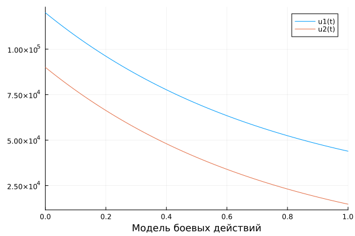
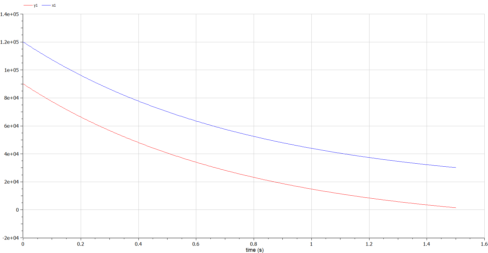
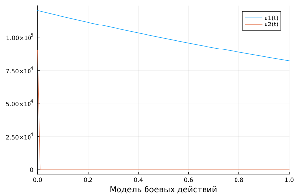
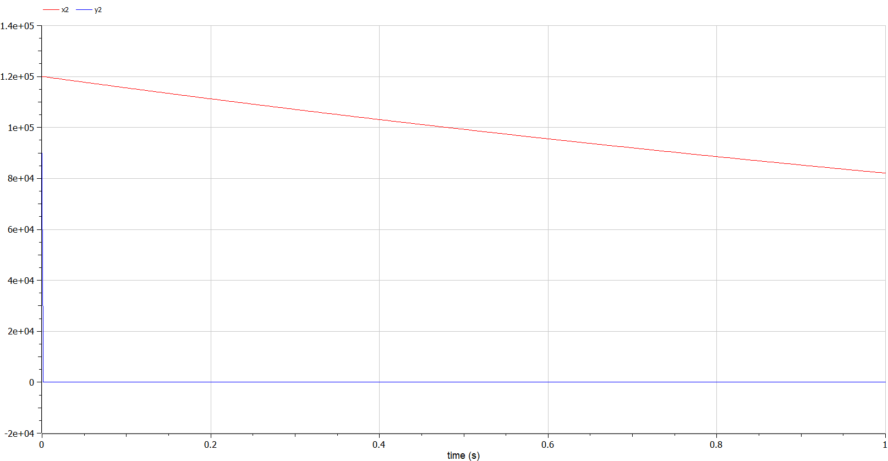

---
## Front matter
title: "Лабораторная работа №3"
subtitle: "Модель боевых действий вариант 11"
author: "Арам Грачьяевич Саргсян"

## Generic otions
lang: ru-RU
toc-title: "Содержание"

## Bibliography
bibliography: bib/cite.bib
csl: pandoc/csl/gost-r-7-0-5-2008-numeric.csl

## Pdf output format
toc: true # Table of contents
toc-depth: 2
lof: true # List of figures
lot: true # List of tables
fontsize: 12pt
linestretch: 1.5
papersize: a4
documentclass: scrreprt
## I18n polyglossia
polyglossia-lang:
  name: russian
  options:
	- spelling=modern
	- babelshorthands=true
polyglossia-otherlangs:
  name: english
## I18n babel
babel-lang: russian
babel-otherlangs: english
## Fonts
mainfont: PT Serif
romanfont: PT Serif
sansfont: PT Sans
monofont: PT Mono
mainfontoptions: Ligatures=TeX
romanfontoptions: Ligatures=TeX
sansfontoptions: Ligatures=TeX,Scale=MatchLowercase
monofontoptions: Scale=MatchLowercase,Scale=0.9
## Biblatex
biblatex: true
biblio-style: "gost-numeric"
biblatexoptions:
  - parentracker=true
  - backend=biber
  - hyperref=auto
  - language=auto
  - autolang=other*
  - citestyle=gost-numeric
## Pandoc-crossref LaTeX customization
figureTitle: "Рис."
tableTitle: "Таблица"
listingTitle: "Листинг"
lofTitle: "Список иллюстраций"
lotTitle: "Список таблиц"
lolTitle: "Листинги"
## Misc options
indent: true
header-includes:
  - \usepackage{indentfirst}
  - \usepackage{float} # keep figures where there are in the text
  - \floatplacement{figure}{H} # keep figures where there are in the text
---

# Цель работы

Рассмотрим некоторые простейшие модели боевых действий – модели
Ланчестера. В противоборстве могут принимать участие как регулярные войска,
так и партизанские отряды. В общем случае главной характеристикой соперников
являются численности сторон. Если в какой-то момент времени одна из
численностей обращается в нуль, то данная сторона считается проигравшей (при
условии, что численность другой стороны в данный момент положительна).


# Задание

Между страной Х и страной У идет война. Численность состава войск
исчисляется от начала войны, и являются временными функциями
x(t) и y(t). В начальный момент времени страна Х имеет армию численностью 120 000 человек,
а в распоряжении страны У армия численностью в 90 000 человек. Для упрощения модели считаем, 
что коэффициенты a, b, c, h постоянны. Также считаем P(t) и Q(t)
непрерывные функции. Постройте графики изменения численности войск армии Х и армии У для
следующих случаев:

1. Модель боевых действий между регулярными войсками

$$
 \begin{cases}
	\frac{dx}{dt}= -0.62x(t) - 0.68y(t) + sin(2t)
	\\   
	\frac{dy}{dt}= -0.59x(t) - 0.71y(t) + cos(2t)
 \end{cases}
$$

2. Модель ведение боевых действий с участием регулярных войск и
партизанских отрядов

$$
 \begin{cases}
	\frac{dx}{dt}= -0.38x(t) - 0.68y(t) + sin(2t)
	\\   
	\frac{dy}{dt}= -0.21x(t)y(t) - 0.71y(t) + cos(2t)
 \end{cases}
$$


# Теоретическое введение

Рассмотрим три случая ведения боевых действий: 
1. Боевые действия между регулярными войсками 
2. Боевые действия с участием регулярных войск и партизанских отрядов 
3. Боевые действия между партизанскими отрядами 

В первом случае численность регулярных войск определяется тремя факторами:

1. скорость уменьшения численности войск из-за причин, не связанных с боевыми действиями (болезни, травмы, дезертирство);
2. скорость потерь, обусловленных боевыми действиями противоборствующих сторон (что связанно с качеством стратегии, уровнем вооружения, профессионализмом солдат и т.п.);
3. скорость поступления подкрепления (задаётся некоторой функцией от времени). 

В этом случае модель боевых действий между регулярными войсками описывается следующим образом

$$
 \begin{cases}
	\frac{dx}{dt}= -a(t)x(t) - b(t)y(t) + P(t)
	\\   
	\frac{dy}{dt}= -c(t)x(t) - h(t)y(t) + Q(t)
 \end{cases}
$$

Потери, не связанные с боевыми действиями, описывают члены $–a(t)x(t)$ и $–h(t)y(t)$, члены $–b(t)y(t)$ и $–c(t)x(t)$ отражают потери на поле боя. Коэффициенты $b(t)$, $c(t)$ указывают на эффективность боевых действий со стороны $y$ и $x$ соответственно, $a(t)$,$h(t)$  - величины, характеризующие степень влияния различных факторов на потери. Функции $P(t)$,$Q(t)$  учитывают возможность подхода подкрепления к войскам $X$ и $Y$ в течение одного дня. 

Во втором случае в борьбу добавляются партизанские отряды. Нерегулярные войска в отличии от постоянной армии менее уязвимы, так как действуют скрытно, в этом случае сопернику приходится действовать неизбирательно, по площадям, занимаемым партизанами. Поэтому считается, что темп потерь партизан, проводящих свои операции в разных местах на некоторой известной территории, пропорционален не только численности армейских соединений, но и численности самих партизан. В результате модель принимает вид:

$$
 \begin{cases}
	\frac{dx}{dt}= -a(t)x(t) - b(t)y(t) + P(t)
	\\   
	\frac{dy}{dt}= -c(t)x(t)y(t) - h(t)y(t) + Q(t)
 \end{cases}
$$

Модель ведение боевых действий между партизанскими отрядами с учетом предположений, сделанном в предыдущем случаем, имеет вид:

$$
 \begin{cases}
	\frac{dx}{dt}= -a(t)x(t) - b(t)x(t)y(t) + P(t)
	\\   
	\frac{dy}{dt}= -h(t)y(t) - c(t)x(t)y(t) + Q(t)
 \end{cases}
$$

# Выполнение лабораторной работы

## Код программы (Julia)

```
using Plots
using DifferentialEquations

x0 = 120000
y0 = 90000
t0 = 0
tmax = 1.7

a1 = 0.62
b1 = 0.68
c1 = 0.59
h1 = 0.71

a2 = 0.38
b2 = 0.68
c2 = 0.21
h2 = 0.71

function P(t)
    return sin(2*t)
end

function Q(t)
    return cos(2*t)
end

function f1(dy, y, p, t)
    dy[1] = -a1*y[1] - b1*y[2] + P(t)
    dy[2] = -c1*y[1] - h1*y[2] + Q(t)
end

function f2(dy, y, p, t)
    dy[1] = -a2*y[1] - b2*y[2] + P(t)
    dy[2] = -c2*y[1]*y[2] - h2*y[2] + Q(t)
end

u0 = [x0; y0]
tspan = (t0, tmax)
t = collect(LinRange(0,2,100))

prob1 = ODEProblem(f1, u0, tspan)
sol = solve(prob1, saveat=t)
plot(sol, xlabel="Модель боевых действий")
savefig("D:\\julia\\lab3julia01.png")

prob2 = ODEProblem(f2, u0, tspan)
sol2 = solve(prob2, saveat=t)
plot(sol2, xlabel="Модель боевых действий")
savefig("D:\\julia\\lab3julia02.png")
```
## Код программы (OpenModelica)

```
model laba3

Real x1(start=120000);
Real y1(start=90000);
Real x2(start=120000);
Real y2(start=90000);

parameter Real a1=0.62;
parameter Real b1=0.68;
parameter Real c1=0.59;
parameter Real h1=0.71;

parameter Real a2=0.38;
parameter Real b2=0.68;
parameter Real c2=0.21;
parameter Real h2=0.71;

equation
  der(x1) = -a1*x1 - b1*y1 + sin(2*time);
  der(y1) = -c1*x1 - h1*y1 + cos(2*time);

equation
  der(x2) = -a2*x2 - b2*y2 + sin(2*time);
  der(y2) = -c2*x2*y2 - h2*y2 + cos(2*time);

end laba3;
```

# Результаты проведенной работы

## 1 случай

{ #fig:001 width=70% height=70% } (рис. @fig:001).

{ #fig:002 width=70% height=70% } (рис. @fig:002).

Победа достается армии $X$.

## 2 случай

{ #fig:003 width=70% height=70% } (рис. @fig:003).

{ #fig:004 width=70% height=70% } (рис. @fig:004).

Победа достается армии $X$.

# Выводы

В результате проделанной лабораторной работы мы познакомились с моделью «Боевые действия». 
Проверили, как работает модель в ситуациях с участием только регулярных ввойск и с участием также партизанских отрядов,
построили графики $y(t)$ и $x(t)$ в рассматриваемых случаях.

# Список литературы {.unnumbered}

1. [Модель боевых действий (https://esystem.rudn.ru/pluginfile.php/1971725/mod_resource/content/2/%D0%9B%D0%B0%D0%B1%D0%BE%D1%80%D0%B0%D1%82%D0%BE%D1%80%D0%BD%D0%B0%D1%8F%20%D1%80%D0%B0%D0%B1%D0%BE%D1%82%D0%B0%20%E2%84%96%202.pdf)
