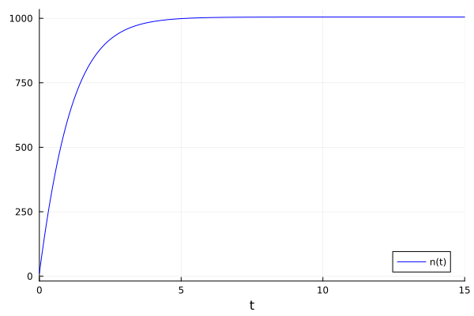
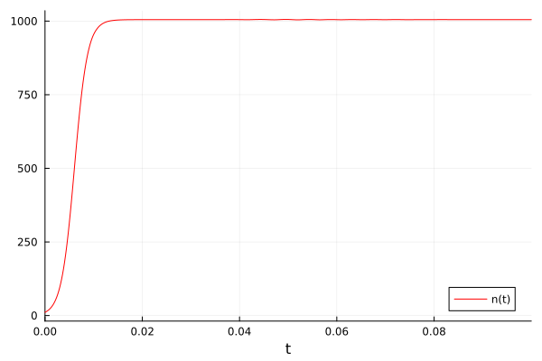
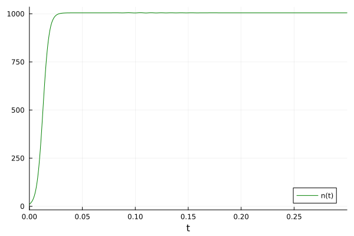

---
## Front matter
title: "отчёт по лабораторной работе №7"
subtitle: "Эффективность рекламы"
author: "Саргсян Арам Грачьяевич"

## Generic otions
lang: ru-RU
toc-title: "Содержание"

## Bibliography
bibliography: bib/cite.bib
csl: pandoc/csl/gost-r-7-0-5-2008-numeric.csl

## Pdf output format
toc: true # Table of contents
toc-depth: 2
lof: true # List of figures
fontsize: 12pt
linestretch: 1.5
papersize: a4
documentclass: scrreprt
## I18n polyglossia
polyglossia-lang:
  name: russian
  options:
	- spelling=modern
	- babelshorthands=true
polyglossia-otherlangs:
  name: english
## I18n babel
babel-lang: russian
babel-otherlangs: english
## Fonts
mainfont: PT Serif
romanfont: PT Serif
sansfont: PT Sans
monofont: PT Mono
mainfontoptions: Ligatures=TeX
romanfontoptions: Ligatures=TeX
sansfontoptions: Ligatures=TeX,Scale=MatchLowercase
monofontoptions: Scale=MatchLowercase,Scale=0.9
## Biblatex
biblatex: true
biblio-style: "gost-numeric"
biblatexoptions:
  - parentracker=true
  - backend=biber
  - hyperref=auto
  - language=auto
  - autolang=other*
  - citestyle=gost-numeric
## Pandoc-crossref LaTeX customization
figureTitle: "Рис."
tableTitle: "Таблица"
listingTitle: "Листинг"
lofTitle: "Список иллюстраций"
lotTitle: "Список таблиц"
lolTitle: "Листинги"
## Misc options
indent: true
header-includes:
  - \usepackage{indentfirst}
  - \usepackage{float} # keep figures where there are in the text
  - \floatplacement{figure}{H} # keep figures where there are in the text
---

# Цель работы

Построить графики эффективности рекламы.

# Задание
Постройте график распространения рекламы, математическая модель которой описывается
следующим уравнением:

$\frac{dn}{dt}= (0.84 + 0.00022n(t))*(N-n(t))$

$\frac{dn}{dt}=  (0.000022 + 0.74n(t))*(N-n(t))$

$\frac{dn}{dt}=  (0.74 * cos(t) + 0.35* sin(t) * n(t))*(N-n(t))$

При этом объем аудитории $N=1005$, в начальный момент о товаре знает 11 человек. Для
случая 2 определите в какой момент времени скорость распространения рекламы будет
иметь максимальное значение.

# Теоретическое введение

## Эффективность рекламы
Организуется рекламная кампания нового товара или услуги. Необходимо,
чтобы прибыль будущих продаж с избытком покрывала издержки на рекламу.
Вначале расходы могут превышать прибыль, поскольку лишь малая часть
потенциальных покупателей будет информирована о новинке. Затем, при
увеличении числа продаж, возрастает и прибыль, и, наконец, наступит момент,
когда рынок насытиться, и рекламировать товар станет бесполезным.
Предположим, что торговыми учреждениями реализуется некоторая
продукция, о которой в момент времени $t$
из числа потенциальных покупателей $N$ знает лишь $n$ покупателей. Для ускорения сбыта продукции запускается реклама
по радио, телевидению и других средств массовой информации. После запуска
рекламной кампании информация о продукции начнет распространяться среди
потенциальных покупателей путем общения друг с другом. Таким образом, после
запуска рекламных объявлений скорость изменения числа знающих о продукции
людей пропорциональна как числу знающих о товаре покупателей, так и числу
покупателей о нем не знающих.

Модель рекламной кампании описывается следующими величинами.
Считаем, что $\frac{dn}{dt}$ - скорость изменения со временем числа потребителей, узнавших о товаре и готовых его купить,
$t$ - время, прошедшее с начала рекламной кампании,
$N$ - общее число потенциальных платежеспособных покупателей,
$n(t)$ - число  уже информированных клиентов.
Эта величина пропорциональна числу покупателей, еще не знающих о нем, это описывается следующим образом
$\alpha _1(t)(N-n(t))$, где $\alpha _1>0$ -  характеризует интенсивность рекламной кампании (зависит от затрат на рекламу в данный момент времени).
Помимо этого, узнавшие о товаре потребители также распространяют полученную информацию среди потенциальных покупателей, не знающих о нем (в этом случае работает т.н. сарафанное радио). Этот вклад в рекламу описывается величиной  $\alpha _2(t)n(t)(N-n(t))$. эта величина увеличивается с увеличением потребителей узнавших о товаре.

Математическая модель распространения рекламы описывается уравнением:

$$\frac{dn}{dt} = (\alpha _1(t) + \alpha _2(t)n(t))(N-n(t))$$

При $\alpha _1(t) >> \alpha _2(t)$ получается модель типа модели Мальтуса.

В обратном случае $\alpha _1(t) << \alpha _2(t)$ получаем уравнение логистической кривой.

# Выполнение лабораторной работы

## Программа, написанная на julia

```
using Plots, DifferentialEquations

# Первый случай
a = 0.84
b = 0.00022
N = 1005
t = collect(LinRange(0, 15, 500))
n = 11
function syst(dy, y, p, t)
    dy[1] = (a+b*y[1])*(N-y[1])
end
tspan=(0, 15)
prob = ODEProblem(syst, [n], tspan)
sol = solve(prob, saveat = t)
plot(sol,color=:blue, label="n(t)")
savefig("D:\\julia\\lab7jl1.png")

#Второй случай
a = 0.000022
b = 0.74
N = 1005
t = collect(LinRange(0, 0.1, 500))
n = 11
function syst(dy, y, p, t)
    dy[1] = (a+b*y[1])*(N-y[1])
end
tspan=(0, 0.1)
prob = ODEProblem(syst, [n], tspan)
sol = solve(prob, saveat = t)
plot(sol, color=:red, label="n(t)")
savefig("D:\\julia\\lab7jl2.png")

#Третий случай
a = 0.74
b = 0.35
N = 1005
t = collect(LinRange(0, 0.3, 500))
n = 11
function syst(dy, y, p, t)
    dy[1] = (a*sin(t)+b*cos(t)*y[1])*(N-y[1])
end
tspan=(0, 0.3)
prob = ODEProblem(syst, [n], tspan)
sol = solve(prob, saveat = t)
plot(sol, color=:green, label="n(t)")
savefig("D:\\julia\\lab7jl3.png")

```

## Программа, написанная на  OpenModelica
```
model lab7

parameter Real a1 = 0.84;
parameter Real b1 = 0.00022;

parameter Real a2 = 0.000022;
parameter Real b2 = 0.74;

parameter Real a3 = 0.74;
parameter Real b3 = 0.35;

parameter Real N = 1005;

Real n1(start=11);
Real n2(start=11);
Real n3(start=11);

equation
  der(n1) = (a1+b1*n1) * (N-n1);
  der(n2) = (a2+b2*n2) * (N-n2);
  der(n3) = (a3*sin(time)+b3*cos(time)*n3) * (N-n3);
end lab7;
```

## Результаты

Графики эффективности реклами в 1 случае(рис. @fig:001).

{#fig:001 width=70%}

Графики эффективности реклами во 2 случае(рис. @fig:002).

{#fig:002 width=70%}

Как мы видим, наибольшая эффективность достигает при $t=0.17$.

Графики эффективности реклами в 3 случае(рис. @fig:003).

{#fig:003 width=70%}


# Выводы

Я изучил модель эффективности реклами.

# Список литературы

1. [Эффективность рекламы](https://esystem.rudn.ru/pluginfile.php/1971741/mod_resource/content/2/%D0%9B%D0%B0%D0%B1%D0%BE%D1%80%D0%B0%D1%82%D0%BE%D1%80%D0%BD%D0%B0%D1%8F%20%D1%80%D0%B0%D0%B1%D0%BE%D1%82%D0%B0%20%E2%84%96%206.pdf)
2. [Модель Мальтуса](http://km.mmf.bsu.by/courses/2018/mathmod1/MM_LB1_Population_2019.pdf)
3. [Логистическая модель роста](https://studopedia.ru/29_5129_logisticheskaya-model-rosta.html)

