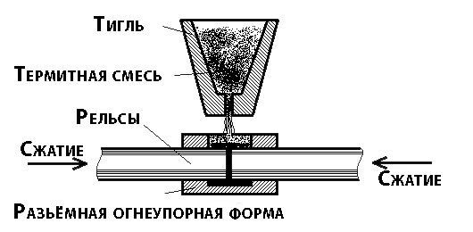

---
## Front matter
lang: ru-RU
title: "Химические реакции, стохастическое горение"
subtitle: "Этап №1 "
author: 
  - Саргсян А. Г.    
  - Тасыбаева Н. С.  
  - Алхатиб Осама  
  - Саинт-Амур Исмаэль  
  - Тазаева А. А.  
  - Юсупов Ш. Ф.  
institute:
  - Российский университет дружбы народов, Москва, Россия
date: 2023 год

## Formatting
mainfont: PT Serif
romanfont: PT Serif
sansfont: PT Sans
monofont: PT Mono
toc: false
slide_level: 2
theme: metropolis
header-includes:
 - \metroset{progressbar=frametitle,sectionpage=progressbar,numbering=fraction}
 - '\makeatletter'
 - '\beamer@ignorenonframefalse'
 - '\makeatother'
aspectratio: 169
section-titles: true

---

## Цели и задачи проекта
Цель проекта: на основе построения ансамбля частиц, в которых
возможна мономолекулярная экзотермическая реакция, изучить принципы математического моделирования

## Цели и задачи проекта

Задачи проекта:

1.	изучить теоретическую информацию об экзотермитеских реакциях
2.	разработать алгоритмы, позволяющие:
     - смоделировать реакцию горения;
     - исследовать влияние нулевой и бесконечной теплопроводности вещества на реакцию;
     - сравнить количество прореагировавшего вещества от температуры;
3.	написать программу, воспользовавшись разработанными в процессе изучения задания алгоритмами;
4.	проанализировать полученные результаты.

## Смысл понятия «экзотермитечкая реакция»
Экзотермическая реакция — химическая реакция или ядерная реакция, сопровождающаяся выделением теплоты. По знаку тепловыделения противоположна эндотермической реакции — реакции с поглощением теплоты.

$$
2H~2~ + O~2~ → 2H~2~O + 483.6\text{КДж}
$$

## Практические примеры
  
         рис. 1 процесс реакции сварки рельсов	
 

## Практические примеры
        рис.2 Термитная сварка рельсов
 

## Используемые физические величины

 -	E − энергия текущего состояния атома
 -	Ea - энергия активации 
 -	k - постоянная Больцмана
 -	T - абсолютная температура, измеряемая в Кельвинах
 -	Т0 - постоянная температура непрореагировавших молекул
 -	c - теплоемкость одной молекулы
 -	N - количество молекул вещества
 -	u - скорость химической реакции, приведенная к одной молекуле
 -	N0 - количество молекул вещества при температуре T0

## Выводы

В работе мы рассмотрели мономолекулярную экзотермическую реакцию, что она из себя представляет и как она происходит.
Так же мы познакомились с основными понятиями, которые используются при изучении и построении уравнений и моделей химических реакций.

