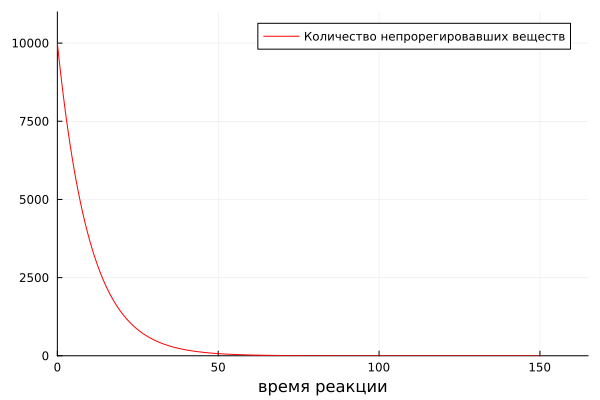
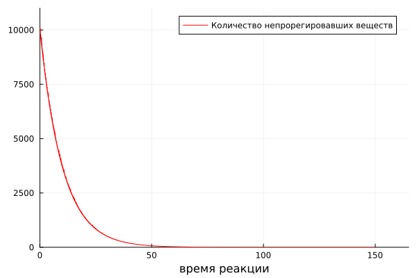

---
## Front matter
lang: ru-RU
title: "Химические реакции, стохастическое горение"
subtitle: "Этап №3"
author: 
  - Саргсян А. Г. 
  - Тасыбаева Н. С.
  - Алхатиб Осама 
  - Саинт-Амур Исмаэль 
  - Тазаева А. А. 
  - Юсупов Ш. Ф. 
institute:
  - Российский университет дружбы народов, Москва, Россия
date: 2023 год

## Formatting
mainfont: PT Serif
romanfont: PT Serif
sansfont: PT Sans
monofont: PT Mono
toc: false
slide_level: 2
theme: metropolis
header-includes:
 - \metroset{progressbar=frametitle,sectionpage=progressbar,numbering=fraction}
 - '\makeatletter'
 - '\beamer@ignorenonframefalse'
 - '\makeatother'
aspectratio: 169
section-titles: true

---

## Цели и задачи
Цель проекта: на основе построения ансамбля частиц, в которых
возможна мономолекулярная экзотермическая реакция, изучить принципы математического моделирования.

## Цели и задачи 

Задачи проекта:

1.	Реализовать программу с алгоритмом расчета количества непрореагировавших молекул при нулевой теплопроводности вещества;
2.	Реализовать программу с алгоритмом расчета количества непрореагировавших молекул при бесконечной теплопроводности вещества;
3.	Смоделировать реакцию несколько раз, исследовать результаты при разных значениях

## Общая программная реализация

```
using Plots
using DifferentialEquations

N0 = 10000   #изначальное количество молекул
Ea = 10^(-23) #Энергия активации
k = 1.38*(10^(-23)) #Постоянная Больцмана
T0 = 100 #Температура вещества
ti=10 #характерное время перераспределения Энергии
u=-1/ti*exp(-Ea/(k*T0))
q=25000 #выделевшаяся теплота
c=14 #теплоемкость одной молекулы

#время моделирования
t0=0
tmax=150
t = range(t0,tmax, step=0.01)

```

## Расчет количества непрореагировавших молекул при 0 теплопроводности

```
function N(t)
   E=rand()*2*Ea
   if E>Ea
    return N0 * exp(u*t)
   else 
    return N(t-0.001)
   end
end

plot(t, 
     N,
     label="Количество непрорегировавших веществ",
     xlabel="время реакции",
     color=:red,
     xlim=[0,1.1*tmax], 
     ylim=[0,1.1*N0])
savefig("D:\\julia\\jl01.png")

```

## Программная реализация при бесконечной теплопроводности вещества

```
function N1(t)
   T=T0+q*t/(N0*c)
   u1=-1/ti*exp(-Ea/(k*T))
   E=rand()*2*Ea
   if E>Ea
    return N0 * exp(u1*t)
   else 
    return N1(t-0.05)
   end
end

plot(t, 
     N1,
     label="Количество непрорегировавших веществ",
     xlabel="время реакции",
     color=:red,
     xlim=[0,1.1*tmax], 
     yim=[0,1.1*N0])
savefig("D:\\julia\\jl02.png")
```

## Результаты

  рис. 1 случай нулевой теплопроводности	
 

## Результаты

  рис. 2 случай бесконечной теплопроводности	
 

## Выводы

На данном этапе нашего проекта мы реализовали программу решения задачи при случаях, когда вещество имеет нулевую теплопроводность, и при случае, когда теплопроводность бесконечная, а процесс адиабатический, а также смоделировали реации при разных значениях.

